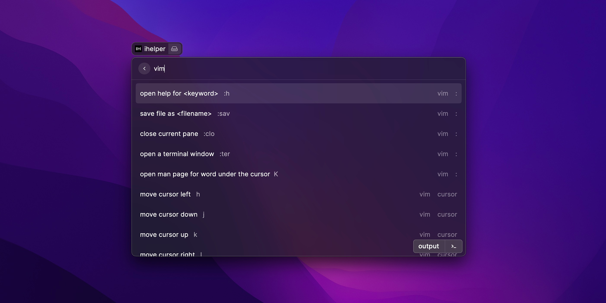

# ihelper

the extension of raycast.

find command or hotkey with index, and output that.

# how to use

user need prepare a CSV file at `~/.ihelper.csv`,this CSV file is your dictionary.

if you want raycast help you input `vim` command,  just write lines like `vim;cursor;,move cursor left,h,1` in `~/.ihelper.csv`

then you can tap `v` in searchbar and see this line, tap enter, then `h` output, the `move cursor left` executed. (but after editing dictionary file, you need reload dictionary from `~/.ihelper.csv` first)

## whats meaning of `vim;cursor;,move cursor left,h,1`

the `.csv` dictionary is a group of lines. each line is in this format: `<tag;tag;...>,<description>,<output>,<output-type>` 

### tags

when you tap `v`，this extension will try to find all dictionary lines which tags could match `v`. so `vim` could match `v`.

### description

.description just the description of .output

`move cursor left` just the description of `h`

### output

.output is what will output when you tap enter

### output-type

there 3 type of output

1 = text output

2 = hotkey exec; for example, if `.output` = `ctrl + c`, these keys will be press. 

3 = JSON array for multiple output; the .output format is `[<output-type>, "<output-content>"], [<second-output-type>, "<second-output-content>"] ...`

## other

you can also try this software `https://github.com/fumeboy/ihelper` in the same purpose

